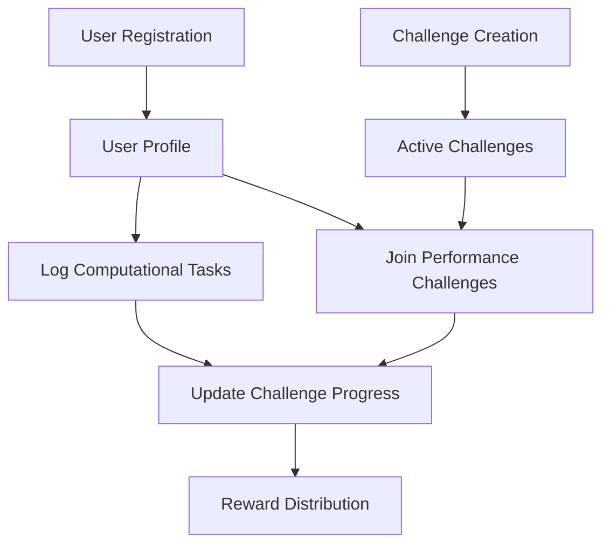

# Compile Flashbot

A blockchain-based computational task tracking platform built on Stacks that enables users to log, verify, and earn rewards for performance-critical tasks and computational contributions.

## Overview

Compile Flashbot bridges blockchain technology with computational task tracking, creating a transparent and incentivized ecosystem for developers, researchers, and computational service providers. The platform provides:

- Immutable task and performance records
- Verifiable computational challenge participation
- Automated reward distribution for achieving performance goals
- Transparent tracking of computational resources
- Incentive mechanisms for critical infrastructure tasks

## Architecture

The Compile Flashbot platform is built around a core smart contract that manages user profiles, computational task records, and performance challenges.



### Core Components

1. **User Management**: Handles user registration and profile maintenance
2. **Task Tracking**: Records and validates computational activities
3. **Performance Challenge System**: Manages creation, participation, and completion of computational challenges
4. **Reward Mechanism**: Tracks achievement progress and distributes incentives

## Contract Documentation

### flashbot-tracker.clar

The main contract handling all core functionality of the Compile Flashbot platform.

#### Key Features

- User registration and profile management
- Computational task logging with type validation
- Performance challenge creation and management
- Challenge participation tracking
- Automated progress updates

#### Access Control

- General users can register, log tasks, and join challenges
- Challenge creators can manage their challenges
- Contract owner can define and update task types

## Getting Started

### Prerequisites

- Clarinet
- Stacks wallet for interaction

### Installation

1. Clone the repository
2. Install dependencies with Clarinet
3. Deploy contracts to the Stacks network

### Basic Usage

```clarity
;; Register a new user
(contract-call? .fitvault-core register-user "username")

;; Log a workout
(contract-call? .fitvault-core log-workout "running" u30 u300 none)

;; Create a challenge
(contract-call? .fitvault-core create-challenge 
    "30 Day Running Challenge" 
    "Complete 20 runs in 30 days" 
    u100 u130 u20 u15 u1000)

;; Join a challenge
(contract-call? .fitvault-core join-challenge u1)
```

## Function Reference

### Public Functions

#### `register-user`
```clarity
(define-public (register-user (username (string-utf8 50))))
```
Creates a new user profile.

#### `log-workout`
```clarity
(define-public (log-workout 
    (workout-type (string-utf8 20)) 
    (duration-minutes uint) 
    (calories-burned uint) 
    (notes (optional (string-utf8 200)))))
```
Records a new workout activity.

#### `create-challenge`
```clarity
(define-public (create-challenge 
    (name (string-utf8 100)) 
    (description (string-utf8 500))
    (start-date uint)
    (end-date uint)
    (workout-goal uint)
    (min-workout-duration uint)
    (reward-amount uint)))
```
Creates a new fitness challenge.

#### `join-challenge`
```clarity
(define-public (join-challenge (challenge-id uint)))
```
Joins an existing fitness challenge.

### Read-Only Functions

#### `get-user-profile`
```clarity
(define-read-only (get-user-profile (user principal)))
```
Retrieves user profile information.

#### `get-workout`
```clarity
(define-read-only (get-workout (workout-id uint) (user principal)))
```
Retrieves details of a specific workout.

#### `get-challenge`
```clarity
(define-read-only (get-challenge (challenge-id uint)))
```
Retrieves details of a specific challenge.

## Development

### Testing

Run tests using Clarinet:

```bash
clarinet test
```

### Local Development

1. Start a local Clarinet console:
```bash
clarinet console
```

2. Deploy contracts:
```bash
clarinet deploy
```

## Security Considerations

### Limitations

- One workout record per day per user
- Challenge participation requires active user profile
- Challenge rewards are fixed at creation

### Best Practices

1. Always verify challenge parameters before joining
2. Ensure workout data is accurate before submission
3. Monitor challenge end dates to claim rewards
4. Verify transaction success for all operations

### Data Validation

- Workout types must be pre-approved
- Duration and calorie counts must be positive values
- Challenge dates must be logical and in the future
- Username length is limited to 50 characters